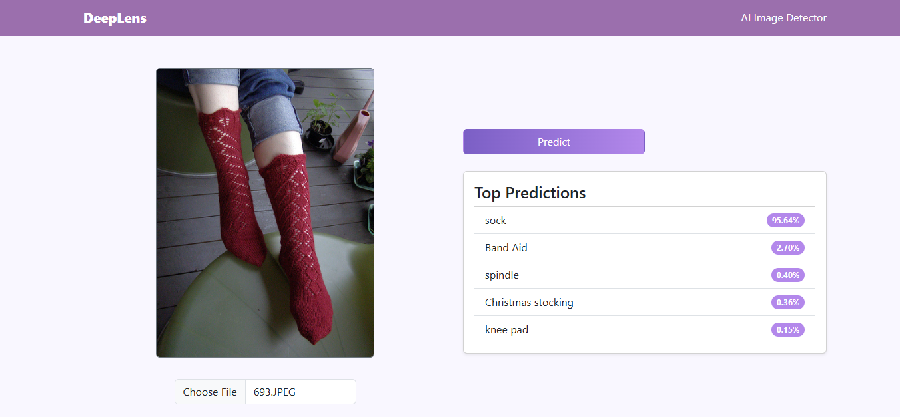

# DeepLens

DeepLens is a **browser-based image classification tool** built with **React** and **TensorFlow.js**. It utilizes a pretrained **MobileNet** convolutional neural network (CNN) to recognize **1000 classes of images** from the ImageNet dataset. This project demonstrates how deep learning models trained in Python/TensorFlow can be deployed on the web using TensorFlow.js.

---

## Demo



Upload an image, click **Predict**, and DeepLens will show the **top-5 predicted classes with probabilities**.

---

## Features

- **Pretrained MobileNet model** converted to TensorFlow.js format.  
- **Client-side inference**: no backend required.  
- **Responsive UI** built with Bootstrap:
  - Upload images
  - Styled gradient button for predictions
  - Display top-5 predictions with probabilities
  - Light-themed design with purple/violet accents
- Fully functional in modern browsers supporting WebGL.

---

## Installation

1. Clone the repository:

```bash
git clone https://github.com/ianwright27/deeplens.git
cd deeplens
```

2. Install dependencies:
```
npm install
```

3. Place the converted TensorFlow.js model (model.json and shards) in the public/tfjs/model/ directory.
```
Start the development server:

npm start
``` 

Open http://localhost:3000 in your browser to use DeepLens.
